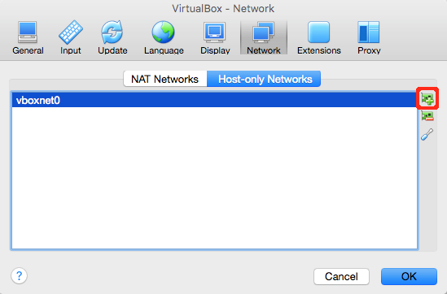
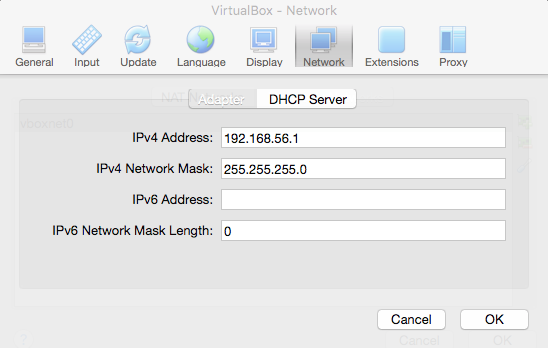
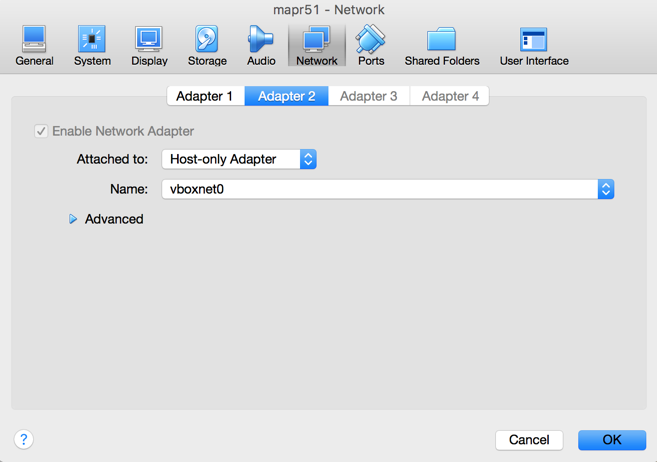
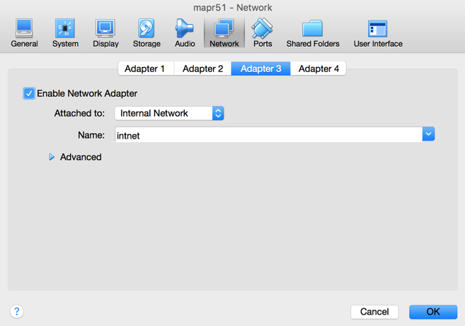
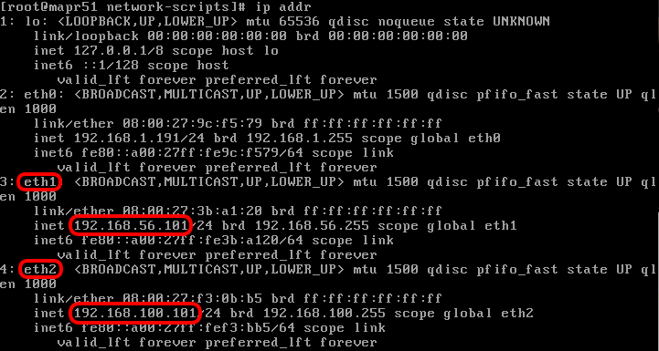

## How to setup the demonstration on a stand alone Mac 

###Introduction

These instructions describe how to make it run locally on a Mac OSX laptop using two VirtualBox VMs - one for the MapR 5.1 Sandbox, and the other running the Ubuntu-based Vagrant VM that Tug built.  I've modified Tug's instructions somewhat to accommodate the OSX VirtualBox environment - what you'll end up with is three network interfaces for each VM:

*   **eth0** - This will enable access to the outside world over your Internet connection via NAT or bridge (your choice)
*   **eth1** - This will enable access from your local machine to the VM via a **host-only** network connection - In my example, this will be:
 *   192.168.56.101 for the MapR Sandbox VM
 *   192.168.56.102 for the Ubuntu Vagrant VM
*   **eth2** - This will enable access between the VMs via an **internal** network connection - In my example, this will be:
 *   192.168.100.101 for the MapR Sandbox VM
 *   192.168.100.102 for the Ubuntu Vagrant VM


The following instructions for setting up this configuration replace steps 1-3 of [General instructions](https://github.com/mapr-demos/racing-time-series). Later, they continue with step 4

### Prerequisites

These need to have been downloaded and installed:

*   [VirtualBox for OSX](https://www.google.com/url?q=https://www.virtualbox.org/wiki/Downloads&sa=D&ust=1458911397498000&usg=AFQjCNE7jTDj5ffTvxL6ytCXGk9wPmy51g)
*   [MapR 5.1 Sandbox for VirtualBox](https://www.google.com/url?q=http://package.mapr.com/releases/v5.1.0/sandbox/MapR-Sandbox-For-Hadoop-5.1.0.ova&sa=D&ust=1458911397499000&usg=AFQjCNGrESG6sHhVaZhmXXXMkQXdaCxxfw)
*   [Vagrant for OSX](https://www.google.com/url?q=https://www.vagrantup.com/downloads.html&sa=D&ust=1458911397499000&usg=AFQjCNF1vuNEcjHlUV1tvG0Bis1KWxvEbg)

### MapR VM Configuration

Note: These instructions assume that you've downloaded and successfully imported the [MapR 5.1 Sandbox for VirtualBox](https://www.google.com/url?q=http://package.mapr.com/releases/v5.1.0/sandbox/MapR-Sandbox-For-Hadoop-5.1.0.ova&sa=D&ust=1458911397500000&usg=AFQjCNFLi7VMpHmxiUIISf_wonS-7mMQ8Q) VM.

* Go to VirtualBox **Preferences > Network > Host-only Networks**.  If no networks are listed then click the green "+" icon on the far-right side:

	

	In my case the Host-only Network is called **vboxnet0** - There doesn't seem to be a way to change the name of the network.  

* Click on the **Edit** icon, which is also on the far-right side, then click the **DHCP Server** button - This will display the configuration settings of my newly-created **vboxnet0** Host-only Network:

	

	Note the **IPv4 Address** that has been specified - in my case, **192.168.56.1** - This will be used later.

* Make sure the MapR Sandbox VM is **shut down**, then go to **Machine > Settings… > Network > Adapter 2**.  Tick the **Enable Network Adapter** checkbox, then set up like so:

	

* Add a third network interface by clicking on **Adapter 3**, then tick the **Enable Network Adapter** checkbox and set up like so:

	

* Click the **OK** button when finished.

* Next, boot the MapR VM and log in from the VirtualBox console, then su to **root**.  

* Navigate to the **/etc/sysconfig/network-scripts** folder.  Look for **ifcfg-eth1** file - it probably won't exist - if it doesn't exist, then create it as a copy of the **ifcfg-eth0** file.
* Edit the **ifcfg-eth1** file and configure similar to this:

	

	Note that I've assigned static IP address **192.168.56.101** based on what was noted earlier from the **DHCP Server** settings of the **vboxnet0** Host-only Network.

* Save and exit from editing the **ifcfg-eth1** file, then copy it to **ifcfg-eth2**.

* Edit the **ifcfg-eth2** file and configure similar to this:

	

	Note that I've assigned static IP address 192.168.100.101 - I'm following a similar pattern to that which was noted earlier from the DHCP Server settings of the vboxnet0 Host-only Network.  
* Save and exit from editing the **ifcfg-eth2** file.

* Restart network services using the **service network restart** command.
* If you execute an **ip addr** command you should see something like this:

	

* At this point it should be possible to ssh into the MapR sandbox from a Mac Terminal window like so:

`ssh mapr@192.168.56.101`

* Note: You may want to add an entry to your **/etc/hosts** file so that you don't have to remember the IP address

* Change to **root** and add the Sandbox VM's host name to the MapR sandbox's **/etc/hosts** file (be sure to map to the localhost IP as shown):
```
[root@mapr51 ~]# cat /etc/hosts
127.0.0.1           localhost        mapr51
```
* **cd** to the directory where the project will reside - In my case I used **$HOME/git** - Then clone Tug's repository like so:
```
cd $HOME/Documents/Git
git clone https://github.com/mapr-demos/racing-time-series.git
```
* Determine the IDs of the mapr user and group:
```
[mapr@mapr51 ~]$ id -u
500
[mapr@mapr51 ~]$ id -g
500
```
* Edit the **$HOME/git/racing-time-series/demo/config.conf** file and change the UID and GID to what was determined immediately above (if necessary).  Also, set the CLUSTER_IP value to the **internal** IP address that you assigned to the **MapR Sandbox VM**.  Here's what mine looks like:
```
# Change UID if you have non-default
MAPR_UID=500
# Change GID if you have non-default
MAPR_GID=500

# CLUSTER_IP is optional if you specified CLUSTER_HOST (which is real DNS name)
CLUSTER_IP=192.168.100.101

# CLUSTER_HOST is optional if you specified CLUSTER_IP
CLUSTER_HOST=mapr51

# Set your MapR cluster name
CLUSTER_NAME=my.cluster.com`
```
*   Run the **setup-streams.sh** script:
```
[mapr@mapr51 demo]$ ./setup-streams.sh
> Deleting old /apps/racing/stream/ stream
> Deleting old /apps/racing table and other information
16/03/24 13:39:35 INFO Configuration.deprecation: io.bytes.per.checksum is deprecated. Instead, use dfs.bytes-per-checksum
16/03/24 13:39:35 INFO fs.TrashPolicyDefault: Namenode trash configuration: Deletion interval = 0 minutes, Emptier interval = 0 minutes.
Deleted /apps/racing 
> Create base dir for Racing Application /apps/racing/ 
> Create stream -path /apps/racing/stream
> Create topic -path /apps/racing/stream -topic all
> Create topic -path /apps/racing/stream  -topic events
> Create topic -path /apps/racing/stream -topic car1
> Create topic -path /apps/racing/stream -topic car2
> Create topic -path /apps/racing/stream -topic car3
> Create topic -path /apps/racing/stream -topic car4
> Create topic -path /apps/racing/stream -topic car5
> Create topic -path /apps/racing/stream -topic car6
> Create topic -path /apps/racing/stream -topic car7
> Create topic -path /apps/racing/stream -topic car8
> Create topic -path /apps/racing/stream -topic car9
> Create topic -path /apps/racing/stream -topic car10
> Create base dir for MapR DB tables /apps/racing/db/telemetry
======  Streams and Topics Created
```
### Vagrant VM Configuration

*   From a new Mac **Terminal**  window **cd** to the directory where the project will reside - In my case I used **$HOME/Documents/Git** - Then clone Tug's repository like so:
```
cd $HOME/Documents/Git
git clone https://github.com/mapr-demos/racing-time-series.git
```
*   Edit the **$HOME/Git/racing-time-series/demo/Vagrantfile**:
	* Set the first **private_network** to an IP address in the same subnet as you assigned to the **MapR Sandbox VM**'s **host-only** interface - Since my MapR Sandbox VM's host-only interface is IP 192.168.56.101, I used **192.168.56.102** for this.  
	* Add a second **private_network** line immediately below and similarly set it to an IP address in the same subnet as you assigned to the **MapR Sandbox VM**'s **internal** interface - Since my MapR Sandbox VM's internal interface is IP 192.168.100.101, I used **192.168.100.102** for this.
	* Important note: Since that second **private_network** line will be for the **internal network**, be sure to include the **virtualbox__intnet** suffix as shown below (note the double underscore there - that's crucial)

	Here's what my **Vagrantfile** looks like::
```
# -*- mode: ruby -*-
 
# vi: set ft=ruby :
 
Vagrant.configure(2) do |config|
  config.vm.box = "box-cutter/ubuntu1404-desktop"
  config.vm.network "private_network", ip: "192.168.56.102"
  config.vm.network "private_network", ip: "192.168.100.102", virtualbox__intnet: true
  config.vm.provider "virtualbox" do |vb|
    # Display the VirtualBox GUI when booting the machine
    vb.gui = true
    # Customize the amount of memory on the VM:
    vb.memory = "4096"
    vb.customize ["modifyvm", :id, "--accelerate3d", "off"]
  end
 
  config.vm.provision "shell", path: "setup.sh"
 
  config.vm.synced_folder ".", "/vagrant", mount_options: ["dmode=777,fmode=777"]
end
```
* Edit the **$HOME/Git/racing-time-series/demo/config.conf** file so that it matches that on the Sandbox VM.

At this point you can continue with Step 4 **Initialise the Racing demonstration** of [Tug's instructions](https://www.google.com/url?q=https://github.com/mapr-demos/racing-time-series&sa=D&ust=1458911397534000&usg=AFQjCNH9xNbNTHIwhFLKgTmJJODE7VS-9Q).  Note that you'll be starting that step in the same Mac Terminal window in which you were working on the **Vagrant VM Configuration** immediately above.

As a side note, you can use your Mac browser to view the Telemetry Streams (instead of the Ubuntu Vagrant VM's browser) using the Ubuntu Vagrant VM's **host-only IP** on **port 8080**\.  So, in my example, you'd go to [http://192.168.56.102:8080/demo.html](https://www.google.com/url?q=http://192.168.56.102:8080/demo.html&sa=D&ust=1458911397535000&usg=AFQjCNEA8Lcxcl5CN_nejswbQJybKG1Afw). Just be sure to open this link on the browser before starting the race via the TORCS simulator, else the charts won't update.
